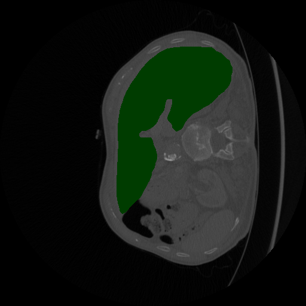

# DICOM_segmentation
A simple python program that tries to give an accurate organ segmentation
from an approximate contour.

### Dependencies
```
numpy
cv2
```

### Examples

 ->   ->  ->  ->   


 ->  ->  

 ->  ->  