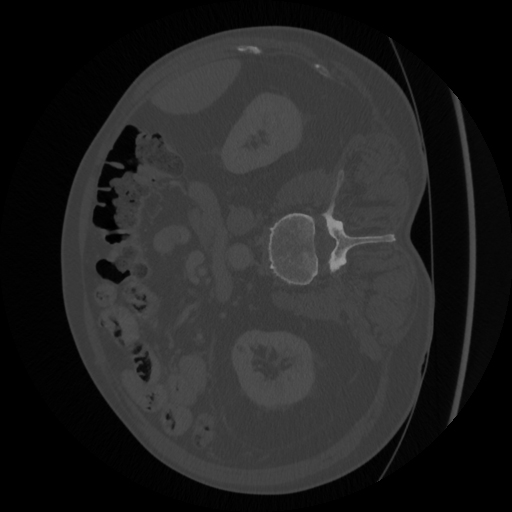
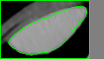
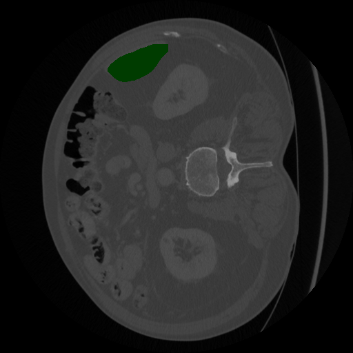

# DICOM Segmentation
A simple python program that tries to give an accurate organ segmentation
from an approximate contour.

### Dependencies
```bash
pip install numpy
pip install opencv-python # cv2
```

## Examples

 ->   ->  ->  ->   

 ->  ->  

 ->  ->  

 ->  ->  


## Getting Started
This module provides a method ```extract_mask``` that expects a numpy array of the dicom file, and a numpy array for the segmentation.
You can also provide a ```sensitivity```for the organ detection, it directly controls the thresholding range;
lower values will result in less false positives, but also might make the segmentation incomplete.
A value for the ```kernel_size``` can also be provided, this controls the smoothing amout of the image after cleanup.

The method retuns a mask of the accurate organ segmentation, this mask can be then feed into ```write_mask``` and ```overlay_mask```
to save the result and preview it over an input image.

## Usage
Run test cases:
```python
test.py # runs the program on default test cases 
```

Custom inputs:
```python
# read the two matrices
layer, seg = read_input(path_to_dicom_file, path_to_segmentation_file)

# extract the mask
mask = extract_mask(layer, seg, sensitivity=0.7, ksize=(4, 4), debug=True)

# write the mask to a file
write_mask(output_path + 'optim.out', mask)

# optinally see an overlay of how the algorithm performed
overlay_mask(path_to_dicom_png, mask)
```


## Implementation
1. In order to extract the mask, we first extract a subarray from the input array to process, this subarray contains the organ and a buffer border,
since edges might've been cut in the approximate contour. This is done to make the processing faster and avoid any confusion when thresholding.
  

- The subarray is extracted as an image, that means it converts the dicom Hounsfield values into 8bit color space. To avoid information loss, the average of
the top most common values in the approximate contour are taken as the middle of the color space (128 in 8bit). This is done using the geometric mean of the values.

- Since the variation in same organ values doesn't exceed 200 (400-600 worst case in lungs), the 256 space should preserve all usefull information.

- The background information (like bones or air) can be lost since it doesn't interest this segmentation, it will just be clamped to 8bits.

2. After extracting, the image is filtered using ```prepare_image```, the image is denoised and blured with default values that seem to work verry well for this color range, but custom parameters can always be set manually.
Adjusting the contrast seems to give bad results in my experince, so in the test files, it is turned off.


3. Now it'll be getting the average organ value of the processed image and use that for thresholding the organ. This is "our guess" of the organ, and it should be an aggressive guess since it will drive the watershed algortihm later.


- Also in this step it'll apply an erosion to the threshold mask to remove any little artifacts and enforce separation of the organs.

4. This is the step where the magic happens, the method ```get_mask_wathersed``` gives us a rough but accurate mask of the organ, the algorithm is based on the watershed algorithm and starts growing regions from the input markers.
- First we'll mark the regions that we're "sure" are part of the organ, to do this I chose that if a pixel is both part of my aggressive thresholding, and part of the doctos approximate contour, than it should be part of the actual organ. This drives the accuracy of the segmentation and has the highest potential for improvement.
- Then we'll mark the region that we're "sure" is NOT part of the organ, the same logic is applied, it it isn't part of my thresholding and it isn't part of the approximate contour, then it shouldn't be part of the organ.
- Everything else is 'unknown', and will be marked by watershed.
- The region growth start from the sure regions and continues into the unknowns, watershed will mark different regions differently, and since 1 represents the background, and from 2 onwards are other regions, then everything mark with 2 should be our organ.

 

5. Since the image and algorithm are imperfect, we'll get a rough mask from this method, and in the final step, we'll clean it up using ```smooth_edges```.
This will dilate and blur the mask, and perform morphological openings and closings to open the edges and then close all the artifacts and unsual holes.
This step can also make and break the final segmentation and should be further tweaked and improved upon.


